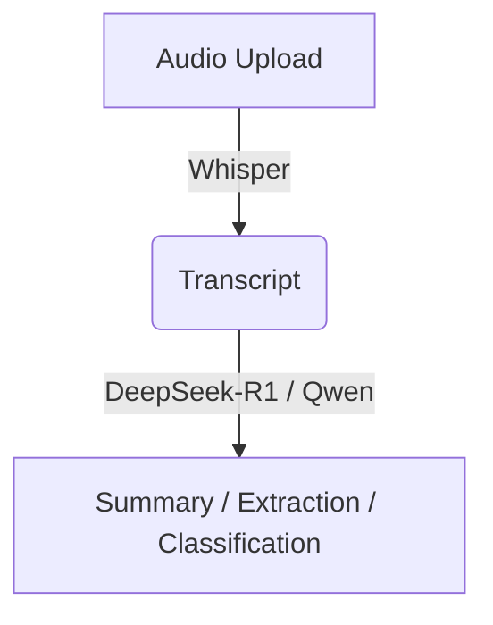

# NotGooglePlus Django

A Django-based web application featuring REST APIs, WebSocket real-time communication, background task processing, and an AI-powered audio processing pipeline (speech-to-text and summarization).

## Features
- **Backend Framework**: Django & Django REST Framework (DRF)
- **Real-time WebSockets**: Django Channels with Daphne
- **Background Tasks**: Celery with Redis broker
- **Cloud Storage**: AWS S3 integration (LocalStack for local development)
- **Analytics Database**: ClickHouse
- **Audio Pipeline**: Whisper (transcription) -> DeepSeek-R1 / Qwen (summarization/extraction)

---

## Prerequisites

- [Python 3.14+](https://www.python.org/downloads/)
- [Poetry](https://python-poetry.org/) (Dependency management)
- Docker & Docker Compose (for backing services like Redis, LocalStack, and ClickHouse)

---

## Local Development Setup

### 1. Clone the repository

```bash
git clone https://github.com/chrisindark/NotGooglePlus-Django.git
cd NotGooglePlus-Django
```

### 2. Install dependencies

This project uses Poetry for dependency management.

```bash
poetry install
```
*(Optional) Activate the virtual environment in your shell:* `poetry shell`

### 3. Start Backing Services (Docker)

Before running the application, start the required background services:

```bash
docker compose up -d redis localstack clickhouse
```

### 4. Database Setup

Run database migrations and create a superuser:

```bash
poetry run python manage.py migrate
poetry run python manage.py createsuperuser --username admin --email admin@example.com
```

### 5. Static Files & Seed Data

Collect static files:

```bash
poetry run python manage.py collectstatic
```

Populate the database with sample data:

```bash
poetry run python manage.py posts --count=3
poetry run python manage.py articles --count=3
poetry run python manage.py seed_audio_posts --count=3
```

---

## Running the Application

You will need to run multiple processes concurrently to support all features (HTTP, WebSockets, and background tasks) during local development.

**1. Django Development Server**
```bash
poetry run python manage.py runserver --settings=notgoogleplus.settings.development
```
_Open your web browser and go to `http://127.0.0.1:8000/`_

**2. Daphne (WebSocket Interface Server)**
```bash
poetry run daphne -b 127.0.0.1 -p 8001 notgoogleplus.asgi:channel_layer
```

**3. WebSocket Worker**
```bash
poetry run python manage.py runworker --settings=notgoogleplus.settings.development
```

**4. Celery Worker (Background Tasks & Audio Processing)**
```bash
poetry run celery -A notgoogleplus_django worker -l INFO -Q celery,transcriptions_queue --pool=solo
```
*(Alternatively, with auto-reload: `poetry run watchfiles "poetry run celery -A notgoogleplus_django worker -l INFO"`)*

---

## Running Entirely with Docker Compose

If you prefer to run the entire stack (including the Django web app) via Docker Compose:

```bash
# Build the images
docker compose build --no-cache

# Start the stack
docker compose up --build
```

**Useful Docker Commands:**
- Run migrations: `docker compose exec web python manage.py migrate`
- Collect static files: `docker compose exec web python manage.py collectstack`
- Stop services: `docker compose down`

---

## Audio Processing Pipeline Architecture

The application includes an AI-driven audio processing pipeline:



